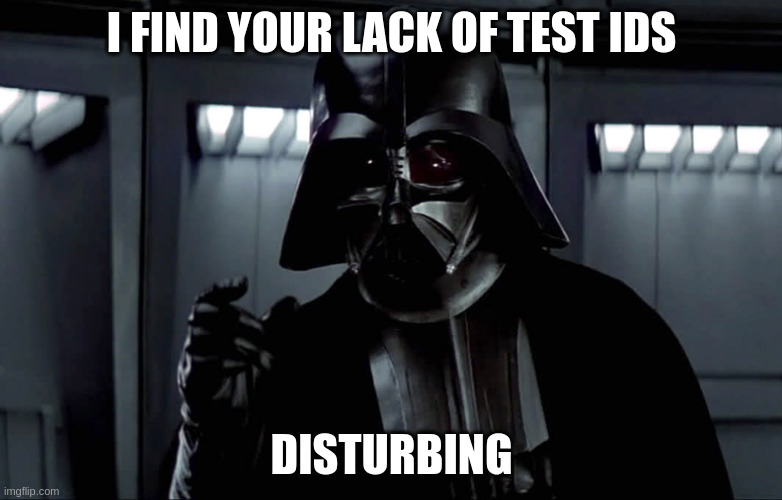

## LoopQADemo - A simple technical evaluation for the Loopers at LoopQA

### Tech Evaluation instructions that I followed can be found [here](https://docs.google.com/document/d/1oGwPbnNImNIlEkwdMcBCUhgQEPclkDss8iFZP2A8AQ0).

### Objectives:
* Maximum code re-use with data-driven testing.
* Playwright with Javascript.
* Scalability - test cases are simple to add, same for targeted environments (Dev/QA/Prod/etc).
* Parallelable - because of test case parameterization it is possible to run this across as many independent workers as you want, limited of course by the number of test cases.
* All test cases pass, of course.

### Limitations:
* No secure store for passwords.  Thankfully it's just a dummy site for use as a tech demo.
* Time.  Perfect is the enemy of progress so this is a minimal viable product, or MVP.
* Commits directly to main, a big no no.  See above note on time.

### Installation and Running:
* Clone repository
* npm install
* npx playwright test
* npx playwright show-report

#### This project was made on a 512GB LED Steam Deck.  Feel free to ask me about the setup in future calls. :)

Bonus meme picture due to having to root around HTML with no test IDs present:

